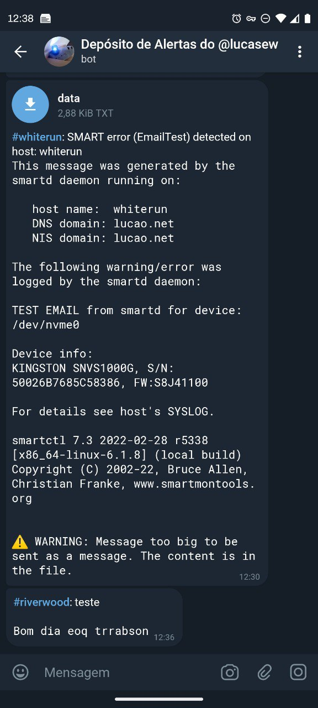

# Telegram Sendmail

The classic sendmail utility standard but sending mail to Telegram instead of SMTP.

## Features
- Tries to send the mail as a text message if small enough, if not then it sends as a file.
- Works using a UNIX socket so tokens are not exposed to the sendmail caller.
- Extracts the headers of the message and sends the subject along with the message.
- Built in Python: Easier to adapt and contribute.
- stdlib only: No additional libraries have been used to build this. Simpler to deploy.
- NixOS ready: Just `imports` in your configuration. I recommend using something like [sops-nix](https://github.com/Mic92/sops-nix) to deal with secrets. [Integration example](https://github.com/lucasew/nixcfg/blob/496f3723e212dbcd94a830f3abfc6973ed5327de/nodes/common/telegram_sendmail.nix#L6).

## TODO
- [ ] Retrying later if failed because of bad Internet connection.
- [ ] Simplify adoption with other distros, like Fedora and Ubuntu.
