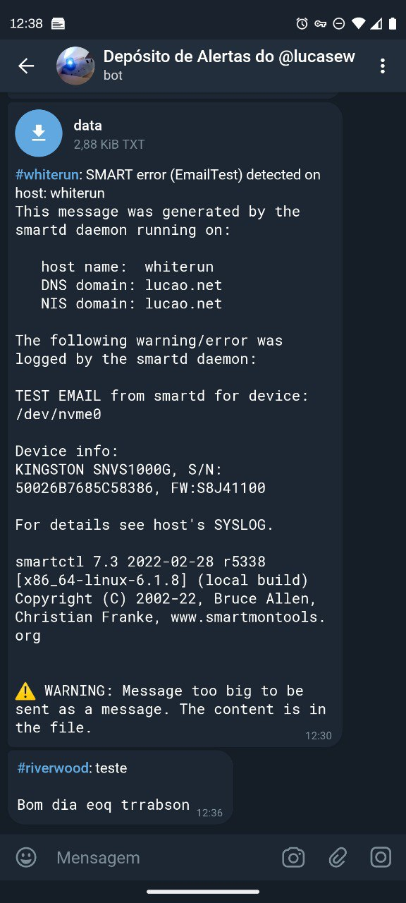

# Telegram Sendmail

The classic sendmail utility standard but sending mail to Telegram instead of SMTP.



## Features
- Tries to send the mail as a text message if small enough, if not then it sends as a file.
- Works using a UNIX socket so tokens are not exposed to the sendmail caller.
- Extracts the headers of the message and sends the subject along with the message.
- Built in Go: Fast, efficient, and easy to deploy.
- NixOS ready: Just `imports` in your configuration. I recommend using something like [sops-nix](https://github.com/Mic92/sops-nix) to deal with secrets. [Integration example](https://github.com/lucasew/nixcfg/blob/496f3723e212dbcd94a830f3abfc6973ed5327de/nodes/common/telegram_sendmail.nix#L6).
- Distro packages (deb / rpm / Arch): binary, systemd units, and a `/usr/sbin/sendmail` shim.

## Install (deb / rpm / Arch)

1. Install the release package for your distro from [GitHub Releases](https://github.com/lucasew/telegram-sendmail/releases).
2. Configure secrets (never shipped in the package):

```bash
sudo cp /usr/share/doc/telegram-sendmail/telegram-sendmail.env.example /etc/telegram-sendmail.env
sudo chmod 600 /etc/telegram-sendmail.env
# edit MAIL_TELEGRAM_TOKEN and MAIL_TELEGRAM_CHAT
sudo systemctl enable --now telegram-sendmail.socket
```

3. Send mail as usual (`sendmail`, cron, etc.). The package installs `/usr/sbin/sendmail` → `telegram-sendmail sendmail`, which pipes stdin to the local socket.

Note: owning `/usr/sbin/sendmail` conflicts with other MTAs (Postfix, etc.). This project is meant as a full replacement on hosts that only need Telegram delivery.

## Release (maintainers)

```bash
mise release patch   # or minor | major | next
```

See `SPEC.md` for packaging layout and design choices.

## TODO
- [x] Retrying later if failed because of bad Internet connection.
- [x] Simplify adoption with other distros (deb / rpm / Arch packages).
